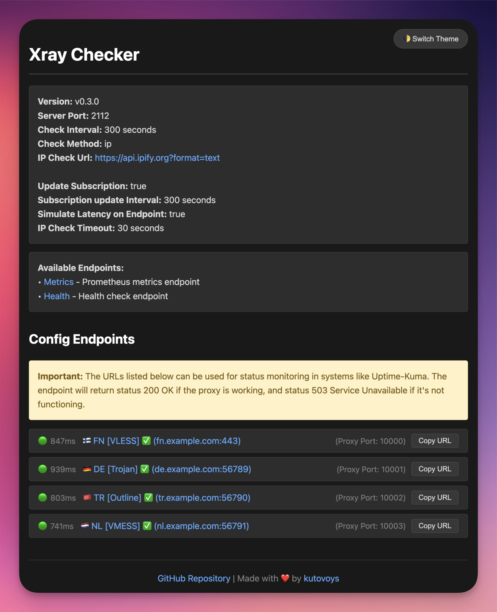

# Xray Checker

[](https://github.com/kutovoys/xray-checker/releases/latest)
[](https://github.com/kutovoys/xray-checker/actions/workflows/build-publish.yml)
[](https://hub.docker.com/r/kutovoys/xray-checker/)
[](https://xray-checker.kutovoy.dev/)
[](https://github.com/kutovoys/xray-checker/blob/main/LICENSE)
[](https://github.com/kutovoys/xray-checker/blob/main/README_RU.md)
[](https://github.com/kutovoys/xray-checker/blob/main/README.md)

Xray Checker is a tool for monitoring proxy server availability with support for VLESS, VMess, Trojan, and Shadowsocks protocols. It automatically tests connections through Xray Core and provides metrics for Prometheus, as well as API endpoints for integration with monitoring systems.

<div align="center">
  
</div>

## 🚀 Key Features

- 🔍 Monitoring of Xray proxy servers (VLESS, VMess, Trojan, Shadowsocks)
- 🔄 Automatic configuration updates from subscription
- 📊 Prometheus metrics export
- 🌓 Web interface with dark/light theme
- 📥 Endpoints for monitoring system integration
- 🔒 Basic Auth protection for metrics and web interface
- 🐳 Docker and Docker Compose support
- 📝 Flexible configuration loading:
  - URL-subscription
  - Base64-strings
  - JSON-files
  - Folders with configurations

Full list of features available in the [documentation](https://xray-checker.kutovoy.dev/intro/features).

## 🚀 Quick Start

### Docker

```bash
docker run -d \
  -e SUBSCRIPTION_URL=https://your-subscription-url/sub \
  -p 2112:2112 \
  kutovoys/xray-checker
```

### Docker Compose

```yaml
services:
  xray-checker:
    image: kutovoys/xray-checker
    environment:
      - SUBSCRIPTION_URL=https://your-subscription-url/sub
    ports:
      - "2112:2112"
```

Detailed installation and configuration documentation is available at [xray-checker.kutovoy.dev](https://xray-checker.kutovoy.dev/intro/quick-start)

## 📈 Project Statistics

<iframe style="width:100%;height:auto;min-width:600px;min-height:400px;" src="https://star-history.com/embed?secret=Z2hwX3JmSjhjNXBkaEhjelBrM3ZRR3FTbTd2d0NPdnVHbDJlWHZhbw==#kutovoys/xray-checker&Date" frameBorder="0"></iframe>

## 🤝 Contributing

We welcome any contributions to Xray Checker! If you want to help:

1. Fork the repository
2. Create a branch for your changes
3. Make and test your changes
4. Create a Pull Request

For more details on how to contribute, read the [contributor's guide](https://xray-checker.kutovoy.dev/contributing/development-guide).
