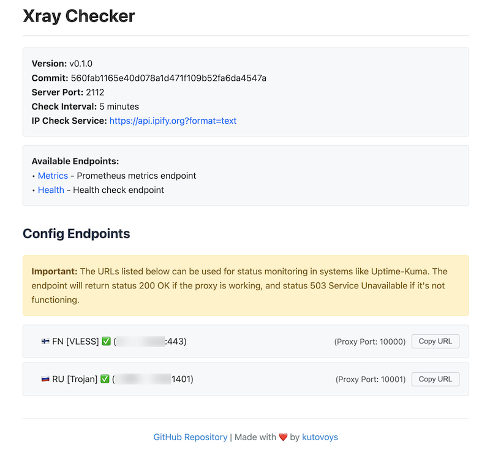

# Xray Checker

[](https://github.com/kutovoys/xray-checker/releases/latest)
[](https://github.com/kutovoys/xray-checker/actions/workflows/build-publish.yml)
[](https://hub.docker.com/r/kutovoys/xray-checker/)
[](https://github.com/kutovoys/xray-checker/blob/main/LICENSE)
[](https://github.com/kutovoys/xray-checker/blob/main/README_RU.md)
[](https://github.com/kutovoys/xray-checker/blob/main/README.md)

Xray Checker - это инструмент для мониторинга доступности прокси-серверов с поддержкой протоколов VLESS, Trojan и Shadowsocks. Он автоматически тестирует соединения через Xray Core и предоставляет метрики для Prometheus, а также API-эндпоинты для интеграции с системами мониторинга.

<div align="center">
  
</div>

## Возможности

- **Поддержка протоколов**: VLESS, Trojan и Shadowsocks
- **Метрики Prometheus**: Экспорт метрик состояния прокси для Prometheus
- **API-эндпоинты**: Отдельные эндпоинты для каждого прокси для интеграции с системой мониторинга
- **Автоматические обновления**: Периодическая проверка и обновление конфигурации из URL подписки
- **Веб-интерфейс**: Простой интерфейс для просмотра статуса прокси и конфигурации
- **Базовая аутентификация**: Опциональная защита метрик и API с помощью базовой аутентификации
- **Поддержка Docker**: Простое развертывание с использованием Docker и Docker Compose

## Метрики

Экспортер предоставляет следующие метрики:

| Название            | Описание                                    |
| ------------------- | ------------------------------------------- |
| `xray_proxy_status` | Статус прокси (1: работает, 0: не работает) |

Каждая метрика включает следующие лейблы:

- `protocol`: Тип протокола (vless/trojan/shadowsocks)
- `address`: Адрес сервера и порт
- `name`: Имя конфигурации прокси

## Конфигурация

Приложение можно настроить с помощью переменных окружения или аргументов командной строки:

| Переменная окружения   | Аргумент командной строки | Обязательно | Значение по умолчанию                   | Описание                                                      |
| ---------------------- | ------------------------- | ----------- | --------------------------------------- | ------------------------------------------------------------- |
| `SUBSCRIPTION_URL`     | `--subscription-url`      | Yes         | -                                       | URL подписки для получения конфигураций                       |
| `RECHECK_SUBSCRIPTION` | `--recheck-subscription`  | No          | `true`                                  | Обновлять подписку при каждой проверке (true) или нет (false) |
| `CHECK_INTERVAL`       | `--check-interval`        | No          | `300`                                   | Интервал проверки в секундах                                  |
| `CHECK_METHOD`         | `--check-method`          | No          | `ip`                                    | Метод проверки (ip/gen)                                       |
| `GEN_METHOD_URL`       | `--gen-method-url`        | No          | `http://cp.cloudflare.com/generate_204` | URL для генерации 204 статуса для проверки методом gen        |
| `IP_CHECK_SERVICE`     | `--ip-check-service`      | No          | `https://api.ipify.org?format=text`     | Сервис для проверки IP методом ip                             |
| `IP_CHECK_TIMEOUT`     | `--ip-check-timeout`      | No          | `30`                                    | Таймаут для проверки IP                                       |
| `START_PORT`           | `--start-port`            | No          | `10000`                                 | Стартовый порт для конфигураций прокси                        |
| `XRAY_LOG_LEVEL`       | `--xray-log-level`        | No          | `none`                                  | Уровень логирования Xray (debug/info/warning/error/none)      |
| `METRICS_PORT`         | `--metrics-port`          | No          | `2112`                                  | Порт для метрик                                               |
| `METRICS_PROTECTED`    | `--metrics-protected`     | No          | `false`                                 | Защита метрик с помощью Basic Auth                            |
| `METRICS_USERNAME`     | `--metrics-username`      | No          | `metricsUser`                           | Имя пользователя для Basic Auth                               |
| `METRICS_PASSWORD`     | `--metrics-password`      | No          | `MetricsVeryHardPassword`               | Пароль для Basic Auth                                         |

### Формат подписки

Содержимое `SUBSCRIPTION_URL` должно быть в формате Base64 Encoded списка прокси. (Стандартный формат Xray-клиентов – Streisand, V2rayNG).

Прокси с портами 0, 1 – будут игнорироваться.

Отправляемые заголовки:

```
Accept: */*
User-Agent: Xray-Checker
```

## Использование

### CLI

```bash
# Базовое использование
./xray-checker --subscription-url="https://your-subscription-url/sub"
```

```bash
# Расширенное использование с пользовательскими настройками
./xray-checker \
  --subscription-url="https://your-subscription-url/sub" \
  --check-interval=120 \
  --ip-check-timeout=5 \
  --metrics-port=2112 \
  --start-port=10000 \
  --xray-log-level=none \
  --metrics-protected=true \
  --metrics-username=custom_user \
  --metrics-password=custom_pass
```

### Docker

```bash
docker run -d \
  -e SUBSCRIPTION_URL=https://your-subscription-url/sub \
  -e CHECK_INTERVAL=5 \
  -p 2112:2112 \
  kutovoys/xray-checker
```

### Docker Compose

```yaml
services:
  xray-checker:
    image: kutovoys/xray-checker
    environment:
      - SUBSCRIPTION_URL=https://your-subscription-url/sub
      - CHECK_INTERVAL=300
      - METRICS_PROTECTED=true
      - METRICS_USERNAME=custom_user
      - METRICS_PASSWORD=custom_password
    ports:
      - "2112:2112"
```

### Конфигурация Prometheus

Добавьте следующее в ваш prometheus.yml:

```yaml
scrape_configs:
  - job_name: "xray-checker"
    static_configs:
      - targets: ["localhost:2112"]
    scrape_interval: 1m
```

## API эндпоинты

- `/` - Информационная страница
- `/metrics` - Эндпоинт метрик Prometheus
- `/health` - Эндпоинт проверки работоспособности
- `/config/{protocol}-{address}-{port}` - Статус конкретного прокси (возвращает 200 OK, если работает, 503, если не работает)

### Интеграция с Uptime Kuma

Вы можете отслеживать каждый прокси с помощью его отдельного эндпоинта в Uptime Kuma:

1. Добавьте новый монитор
2. Выберите "HTTP(s)"
3. Введите URL: `http://your-server:2112/config/vless-example.com-443`
4. Монитор покажет "Up", если прокси работает, и "Down", если он не работает

## Логика проверки соединения

1. Начальная настройка:

   - Получение конфигураций из URL подписки
   - Генерация унифицированного файла конфигурации Xray
   - Запуск экземпляра Xray Core

2. Периодические проверки (каждые N минут):
   - Получение текущего IP без прокси
   - Для каждой конфигурации прокси:
     - Подключение через локальный SOCKS5 порт
     - Попытка получить IP через прокси
     - Сравнение IP для определения работоспособности прокси
     - Обновление метрик Prometheus и внутреннего статуса
   - Проверка URL подписки на изменения
     - При обнаружении изменений:
       - Генерация новой конфигурации Xray
       - Перезапуск экземпляра Xray Core
       - Обновление эндпоинтов

## Участие в разработке

Мы рады любому вкладу в развитие Xray Checker. Будь то исправление ошибок, новые функции или улучшение документации, вот краткое руководство по участию:

1. **Fork & Branch**: Сделайте форк этого репозитория и создайте ветку для ваших изменений
2. **Implement**: Внесите изменения, сохраняя код чистым и документированным
3. **Test**: Убедитесь, что ваши изменения не нарушают существующую функциональность
4. **Commit & PR**: Создавайте коммиты с четкими сообщениями и откройте Pull Request
5. **Feedback**: Будьте готовы к обсуждению и улучшению вашего вклада

Если вы новичок, GitHub предоставляет отличный гайд по [созданию pull request](https://docs.github.com/en/github/collaborating-with-issues-and-pull-requests/creating-a-pull-request).
