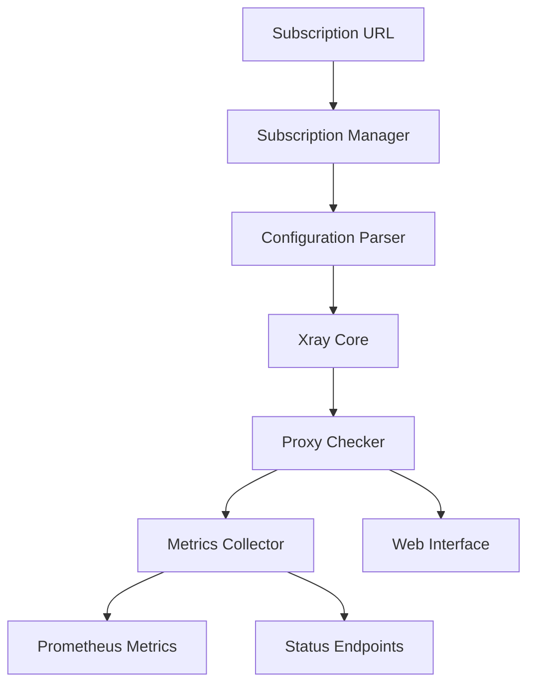
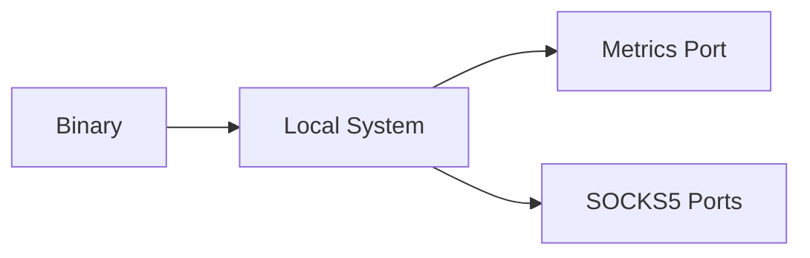
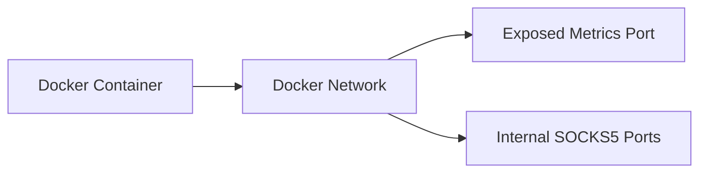

## System Components

Xray Checker consists of several key components working together to provide comprehensive proxy monitoring:

### Core Components

1. **Subscription Manager**

   - Handles proxy configuration retrieval
   - Supports multiple source formats
   - Manages configuration updates
   - Validates proxy configurations

2. **Xray Core Integration**

   - Manages Xray Core process
   - Handles proxy connection setup
   - Maintains SOCKS5 ports
   - Manages configuration updates

3. **Proxy Checker**

   - Performs health checks
   - Measures latency
   - Validates proxy functionality
   - Manages check scheduling

4. **Metrics System**

   - Collects performance metrics
   - Manages Prometheus integration
   - Handles metric persistence
   - Supports push gateway

5. **Web Server**
   - Provides status endpoints
   - Serves web interface
   - Handles API requests
   - Manages authentication

## Data Flow

## Component Details

### Subscription Manager

The subscription manager is responsible for:

- Fetching configuration from subscription URLs
- Parsing various configuration formats
- Validating proxy configurations
- Triggering configuration updates

### Xray Core Integration

Handles all interaction with Xray Core:

- Managing the Xray process lifecycle
- Generating Xray configurations
- Maintaining SOCKS5 ports
- Handling connection setup

### Proxy Checker

Performs the actual proxy verification:

- Scheduled health checks
- Connection testing
- Latency measurement
- Status tracking

### Metrics System

Manages all metrics-related functionality:

- Collecting proxy status metrics
- Tracking latency metrics
- Managing Prometheus integration
- Handling metric pushes

### Web Server

Provides the web interface and API:

- Status endpoint handling
- Web interface serving
- API request processing
- Authentication management

## Security Model

### Authentication

- Optional Basic Auth protection
- Configurable credentials
- Separate authentication for metrics

### Network Security

- Local SOCKS5 ports only
- No direct proxy exposure
- Configurable timeout settings
- TLS support for metrics pushing

### Configuration Security

- Environment variable support
- Secure credential handling
- Protected metric endpoints
- Sanitized configuration handling

## Deployment Architecture

### Standalone Deployment

### Docker Deployment

### GitHub Actions Deployment

## Performance Considerations

### Resource Usage

- Minimal memory footprint
- Efficient proxy checking
- Optimized metric collection
- Controlled update frequency

### Scalability

- Support for multiple proxies
- Concurrent health checks
- Efficient metric handling
- Distributed monitoring support

### Reliability

- Automatic recovery
- Error handling
- Retry mechanisms
- Graceful degradation
